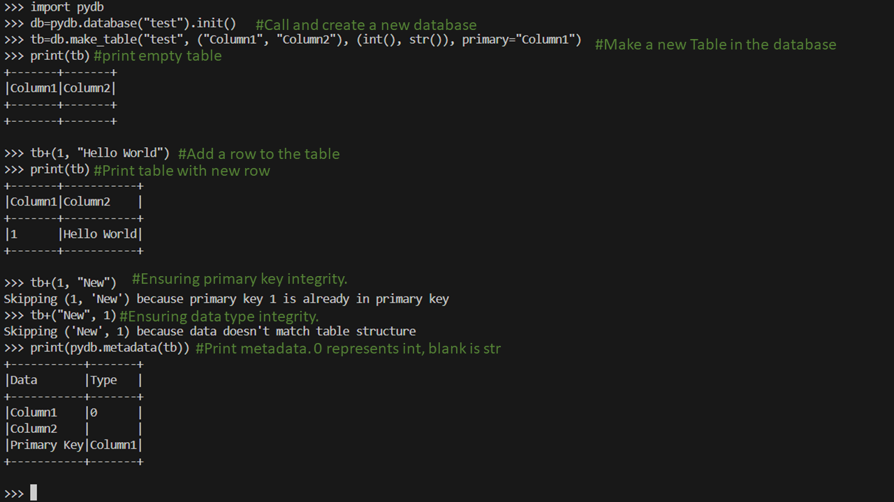

<p align="center">

</p>


-blue)


<!-- Place this tag where you want the button to render. -->
<a class="button" href="https://github.com/HarbingerOfFire" data-color-scheme="no-preference: light; light: light; dark: dark;" data-size="large" aria-label="Follow @HarbingerOfFire on GitHub">Follow @HarbingerOfFire</a>

# BivittatusDB: Operator-Based Relational Database Management System (Stage One)

This is a Python-based relational database management system (RDBMS) designed from scratch with operator-based functionalities. It's a standalone system not compatible with SQL or NoSQL databases, aiming to provide a simple yet functional database management solution.

## Features
- **Operator-based operations**: The database operates using operators such as `+`, `-`, and `==` to manipulate data.
- **Relational Structure**: Organizes data in tables with rows and columns, following a relational database model.
- **Basic CRUD Operations**: Supports basic Create, Read, Update, and Delete operations.
- **Indexing**: Efficient data retrieval with indexing mechanisms.
- **Transaction Management**: Implements transaction management to ensure data consistency.

## Stage One Implementation
At this stage, the database system supports the following features:
- Creating tables with specified columns.
- Inserting data into tables.
- Deleting data from tables.
- Basic querying using select operations.
- Primary Keys (with integrity checks)
- Data typing (with integrity checks)

## Sample From Python interpreter (3.12.2)
(NOTE: Image made bbivittatusDBefore name change. Import bivittatusDB instead of PYDB)


## Future Plans (Stage Two)
For the next stage of development, the following features are planned to be implemented:
- **Foreign Keys**: Establish relationships between tables to enforce referential integrity.
- **Update Values**: Implement functionality to update values directly instead of deleting and adding back.

## Usage
1. Import bivittatusDB into your python file/interpreter.
2. Follow the information from the [wiki](https://github.com/HarbingerOfFire/PYDB/wiki) for more info on specific usage


## Dependencies
The databases are saved in h5 files, and as such requires the h5py module, as seen in the [`requirements.txt`](./requirements.txt) file.
```bash
pip install -r requirements.txt
```

## Contributing
Contributions are welcome! If you'd like to contribute to the project, please fork the repository and submit a pull request with your changes.

## License
This project is licensed under the [MIT License](LICENSE).

This README.md file provides an overview of the operator-based relational database management system implemented in Python, detailing its current features, future plans, usage instructions, dependencies, and contribution guidelines. Additionally, it outlines the licensing information for the project.
