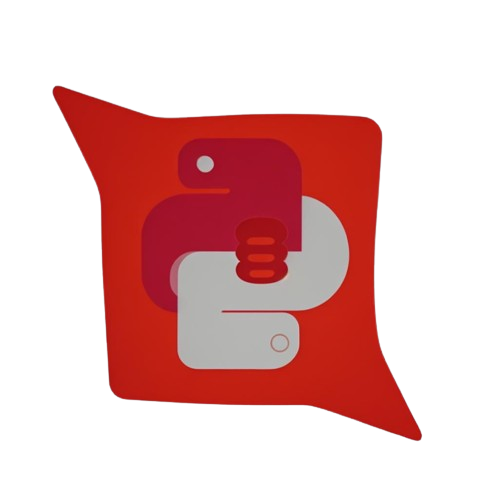

<p align="center">

</p>


-blue)

# BivittatusDB: Operator-Based Relational Database Management System

This is a Python-based relational database management system (RDBMS) designed from scratch with operator-based functionalities. It's a standalone system not compatible with SQL or NoSQL databases, aiming to provide a simple yet functional database management solution.

## Features
- **Operator-based operations**: The database operates using operators such as `+`, `-`, and `==` to manipulate data.
- **Relational Structure**: Organizes data in tables with rows and columns, following a relational database model.
- **Basic CRUD Operations**: Supports basic Create, Read, Update, and Delete operations.
- **Indexing**: Efficient data retrieval with indexing mechanisms.
- **Transaction Management**: Implements transaction management to ensure data consistency.
- **Security**: All databases are asymmetrically encrypted with a user defined password for each database.

## Installation
To install this, use the following command, as the latest commit could (and probably does) have a few errors, but the last stable release is working (as far as we know):
```
git clone https://github.com/HarbingerOfFire/bivittatusDB/releases/tag/v3.0.1
```

## Examples
See the examples directory and [wiki](https://github.com/HarbingerOfFire/PYDB/wiki) for examples off different operations.

## Usage
1. clone the repo and cd into the BivitattusDB directroy
2. Import bivittatusDB into your python file/interpreter.
3. Follow the information from the [wiki](https://github.com/HarbingerOfFire/PYDB/wiki) for more info on specific usage

## Dependencies
The databases are saved in hybrid-asymmetrically encrypted and therefore need encryption handlers, as seen in the [`requirements.txt`](.github/requirements.txt) file.
```bash
pip install -r .github/requirements.txt
```

## Contributing
Contributions are welcome! If you'd like to contribute to the project, please fork the repository and submit a pull request with your changes.See [Contributing](.github/CONTRIBUTING.md) & [Code of Cunduct](.github/CODE_OF_CONDUCT.md)

## License
This project is licensed under the [MIT License](.github/LICENSE).

This README.md file provides an overview of the operator-based relational database management system implemented in Python, detailing its current features, future plans, usage instructions, dependencies, and contribution guidelines. Additionally, it outlines the licensing information for the project.

## Known Issues: 
Due to recent updates, no issues are known at this time. All example files are acting as expected. We are accepting issues if you find anything that we have missed.